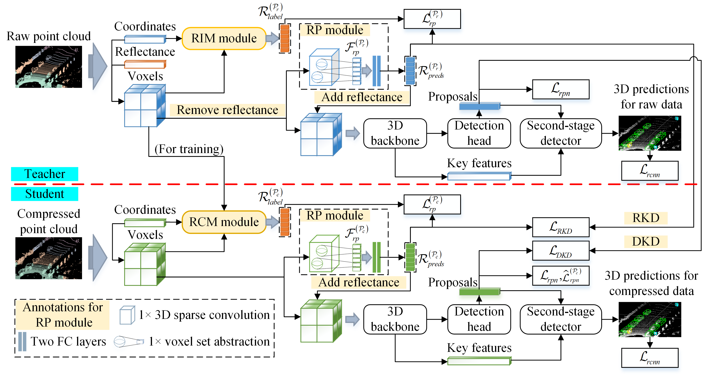
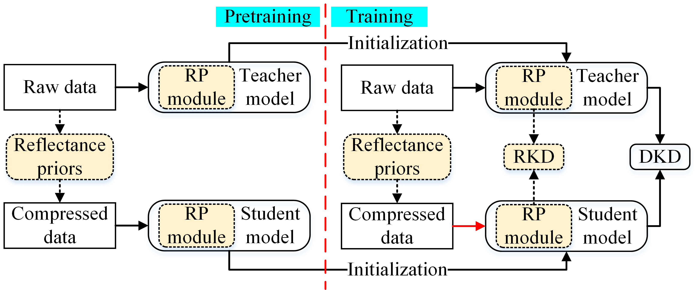

# Reflectance Prediction-Based Knowledge Distillation for Robust 3D Object Detection in Compressed Point Clouds

This is the official implementation of "Reflectance Prediction-Based Knowledge Distillation for Robust 3D Object Detection in Compressed Point Clouds". This repository is based on [`OpenPCDet`](https://github.com/open-mmlab/OpenPCDet) and [`SparseKD`](https://github.com/CVMI-Lab/SparseKD).

**Abstract**: Regarding intelligent transportation systems, low-bitrate transmission via lossy point cloud compression is vital for facilitating real-time collaborative perception among connected agents, such as vehicles and infrastructures, under restricted bandwidth. In existing compression transmission systems, the sender lossily compresses point coordinates and reflectance to generate a transmission code stream, which faces transmission burdens from reflectance encoding and limited detection robustness due to information loss. To address these issues, this paper proposes a 3D object detection framework with reflectance prediction-based knowledge distillation (RPKD). We compress point coordinates while discarding reflectance during low-bitrate transmission, and feed the decoded non-reflectance compressed point clouds into a student detector. The discarded reflectance is then reconstructed by a geometry-based reflectance prediction (RP) module within the student detector for precise detection. A teacher detector with the same structure as the student detector is designed for performing reflectance knowledge distillation (RKD) and detection knowledge distillation (DKD) from raw to compressed point clouds. Our cross-source distillation training strategy (CDTS) equips the student detector with robustness to low-quality compressed data while preserving the accuracy benefits of raw data through transferred distillation knowledge. Experimental results on the KITTI and DAIR-V2X-V datasets demonstrate that our method can boost detection accuracy for compressed point clouds across multiple code rates.



## Dataset Construction
For KITTI, we used 7,481 labeled point cloud samples, split into 3,712 for training and 3,769 for validation. For DAIR-V2X-V, we used 6,509 training frames, split into 4,335 for training and 2,174 for validation. We trained the [`PCC-S`](https://github.com/zlichen/PCC-S) network on the raw point-cloud training split for compression learning, then applied it to reconstruct point clouds at octree levels 12, 11, and 10, denoted as PCC-S-C12, PCC-S-C11, and PCC-S-C10, respectively. Training ran for 20 epochs on a single RTX 8000 GPU with batch size 2 and a maximum octree level of 12.

## Pre-training Raw Point-Cloud Model
The raw point-cloud model is first trained on the original KITTI dataset, and the best-performing checkpoint is then used to initialize the teacher model for knowledge distillation.

### Dataset
```
kitti
│── ImageSets
|── gt_database
│── training
│   ├──calib & velodyne & label_2 & image_2 & planes
```
* The folder “gt_database” contains the ground-truth annotations of the raw point clouds, while “velodyne” stores the raw point-cloud data.

### Training
```
cd tools/
```
Training the Raw Point-Cloud Model on the Voxel-RCNN Baseline Network with 4 GPUs:
```
CUDA_VISIBLE_DEVICES=0,1,2,3 python -m torch.distributed.launch --nproc_per_node=4 train.py --cfg_file ./cfgs/kitti_models/voxel_rcnn/rpvoxel_nr.yaml
```

## Pre-training Compressed Point-Cloud Model
The compressed point-cloud models are first trained on the KITTI dataset at octree levels 12, 11, and 10, denoted as PCC-S-C12, PCC-S-C11, and PCC-S-C10, respectively. The best-performing checkpoint at each level is then used to initialize the corresponding student model for knowledge distillation.

### Dataset
```
kitti
│── ImageSets
|── gt_database
│── training
│   ├──calib & velodyne & label_2 & image_2 & planes
```
* When using the KITTI PCC-S-C11 dataset, the folder “gt_database” contains the PCC-S-C11 ground-truth annotations, while “velodyne” stores the corresponding compressed data.

### Training
```
cd tools/
```
Training the Raw Point-Cloud Model on the Voxel-RCNN Baseline Network with 4 GPUs:
```
CUDA_VISIBLE_DEVICES=0,1,2,3 python -m torch.distributed.launch --nproc_per_node=4 train.py --cfg_file ./cfgs/kitti_models/voxel_rcnn/rpvoxel_rcnn.yaml
```

## Cross-Source Distillation Training Strategy (CDTS)
The proposed CDTS transfers distilled knowledge from raw to low-quality compressed data, significantly improving detection
accuracy.



## License

`SMS` is released under the [Apache 2.0 license](LICENSE).

## Acknowledgement

[`OpenPCDet`](https://github.com/open-mmlab/OpenPCDet)
[`SparseKD`](https://github.com/CVMI-Lab/SparseKD)

## Citation 

If you find this project useful in your research, please consider cite:

```
@ARTICLE{11322695,
  author={Jing, Hao and Wang, Anhong and Zhang, Yifan and Bu, Donghan and Hou, Junhui},
  journal={IEEE Transactions on Image Processing}, 
  title={Reflectance Prediction-Based Knowledge Distillation for Robust 3D Object Detection in Compressed Point Clouds}, 
  year={2026},
  volume={35},
  number={},
  pages={85-97},
  keywords={Image coding;Reflectivity;Point cloud compression;Three-dimensional displays;Object detection;Detectors;Training;Accuracy;Robustness;Feature extraction;Compressed point clouds;3D object detection;knowledge distillation;reflectance prediction},
  doi={10.1109/TIP.2025.3648203}}
```

## Email 

If you have any questions, please contact jinghao@tyust.edu.cn.
